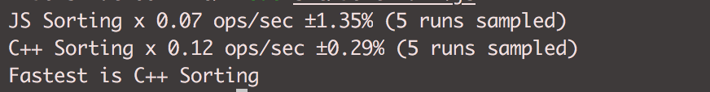

# C++ Addons / Node.js
Node.js Addons are dynamically-linked shared objects, written in C++, that can be loaded into Node.js
using the require() function, and used just as if they were an ordinary Node.js module. They are used primarily to
provide an interface between JavaScript running in Node.js and C/C++ libraries.

## Prerequisites
 [Git](https://git-scm.com/) <br />
 [node](https://nodejs.org) <br />
 [npm](https://www.npmjs.com/) <br />

 ## Installation
 ```sh
 git clone repo_name # or clone your own fork
 cd repo_name
 rm rf .git
 npm install
 ```
## Build C++ Addons 
```sh
   node-gyp config build
```
 
## Running Locally
Go to your project directory.

```sh 
   node-gyp config build
   node src/index.js
```

## Running Benchmark 
 
```sh 
   node src/benchmark.js
```
## Output (Benchmark) 
<b>
 On the following environment
</b>
<br />
 
- Mac OS X 10.13.4 <br />
- Processor: 2.7 GHz Intel Core i5 <br/>
- Memory: 8 GB 1867 MHz DDR3
<br />

<br />

## Author
 [Bibek Shah](bibekshah09@gmail.com) <br />
